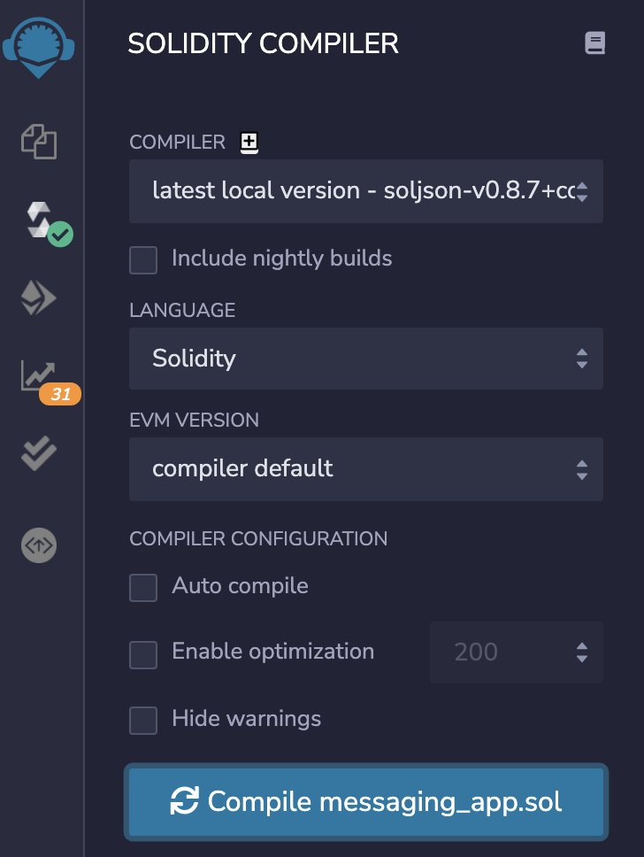
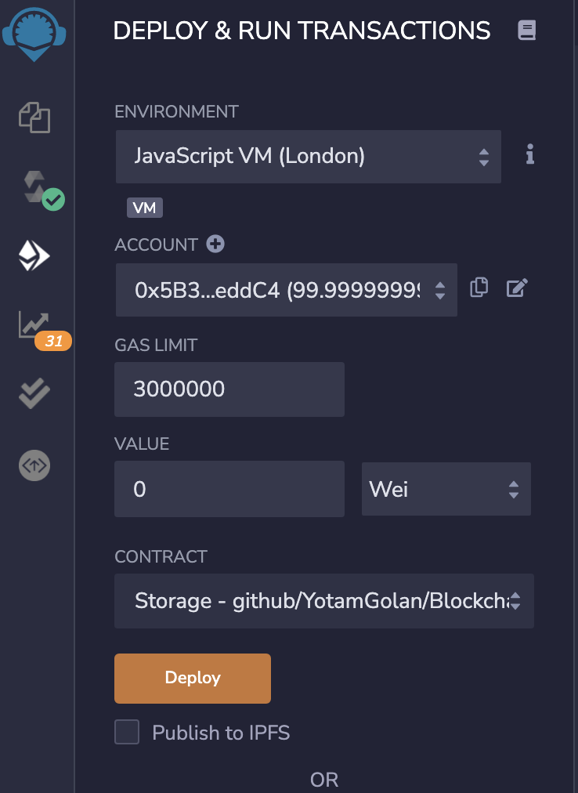
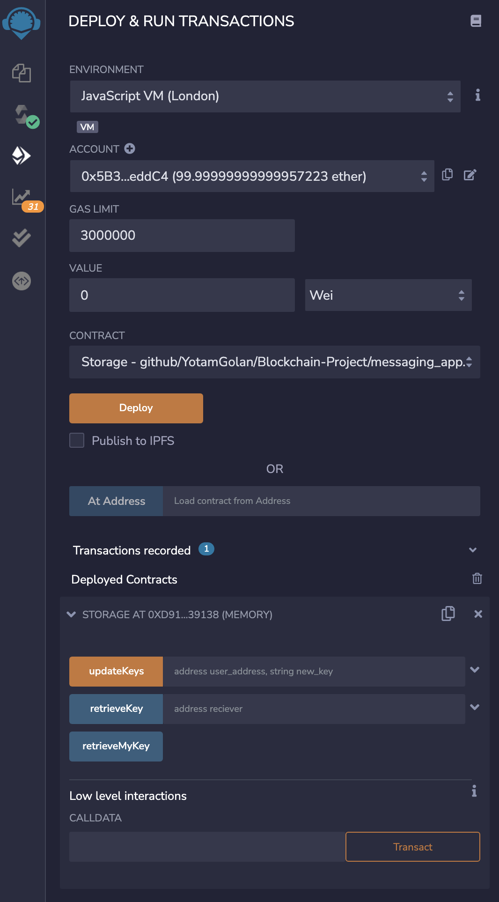
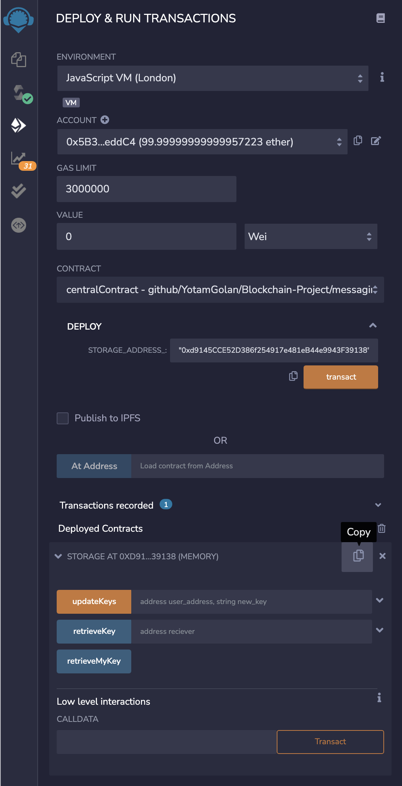
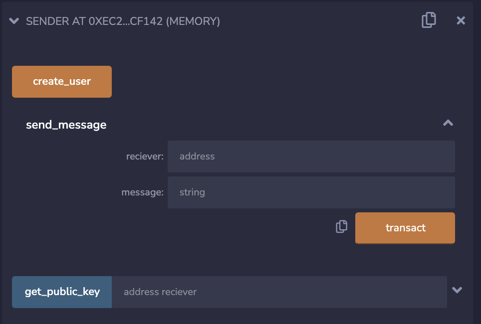

# A Blockchain Approach to Messaging Applications

**Authors**: [Sherif Abdekarim](https://github.com/sherif-abdelkarim), [Yotam Golan](https://github.com/YotamGolan), [Brooke Ryan](https://brookekryan.com/)

CS 295, Blockchain Systems 

UC Irvine Winter 2022

Professor Faisal Nawab

## About

This is the repository for the code associated with the paper **A Blockchain Approach to Messaging Applications**. It is a low-cost, minimalistic messaging application that runs on the [Ethereum Virtual Machine](https://ethereum.org/en/developers/docs/evm/). It was written in [Solidity](https://docs.soliditylang.org/en/v0.8.13/), which is a language designed for writing [smart contracts](https://ethereum.org/en/developers/docs/smart-contracts/) for Ethereum-based applications. 

This application was developed as a course project for CS 295 Blockchain Systems at UC Irvine under the guidance of Professor Faisal Nawab. 

`messaging_app.sol` contains the main code for the project. It contains the smart contracts for storage, the central contract, the sender, and receiver contracts.  

## Deployment

*Note: The instructions provided here deploy the application to an Ethereum testing environment.* 

The following instructions delineate how to deploy all four of the Smart Contracts of the code provided in the paper. For some of the contracts, such as Sender and Receiver, there are multiple ways to instantiate a new user in the system. The outline below is just one of the ways. 

1. Open `messaging_app.sol` in the  Ethereum [Remix IDE](https://remix.ethereum.org/).
2. Navigate to the compiler tab and compile `messaging_app.sol`.

3. Navigate to the Deploy and Run Transactions Tab. Set the Environment to JavaScript VM (London or Berlin).

5. Select the Storage smart contract from the Contract configuration. Press Deploy. 
   1. Ensure that the Storage contract is now listed as a Deployed Contract. 

6. Next, select centralContract from the Contract dropdown menu. Paste the memory address from the Storage smart contract into the `storage_address` parameter, then press transact. 
   1. Ensure that centralContract is listed under Deployed Contracts.  

7. Next, we will deploy the Sender smart contract. Select Sender from the Contract dropdown menu. Paste the centralContract memory address into the `smart_contract_address` parameter, and then paste the encryption public key into the `public_key_` parameter. (Be sure to ensure that the key is surrounded by quotation marks, since it is a string parameter.) Then press Transact. Ensure that the sender smart contract is listed under Deployed Contracts. 
8. Finally, we will deploy the Receiver smart contract. Select Receiver from the Contract dropdown menu. Paste the centralContract memory address into the `smart_contract_address` parameter, and then paste the encryption public key into the `public_key_` parameter. (Be sure to ensure that the key is surrounded by quotation marks, since it is a string parameter.) Then press Transact. Ensure that the Receiver smart contract is listed under Deployed Contracts. 

## Sending and Receiving Messages

Now that the main contracts have been deployed, we can send and receive messages between the existing users in the system. 

#### Sending Messages

1. First, under the deployed Sender contract, we will call the `get_public_key` function. Paste in the memory address from the Receiver contract. Press transact, and observe the response in the console. 

2. Then, on your own local machine, use the obtained public key to encrypt the message.
3. Paste the receiver's memory address into the `receiver` parameter, and paste the encrypted message into the `message` parameter. Press transact. 

#### Receiving Messages 

1. Now, transact the `get_message` function on the Receiver deployed contract. Observe the response in the console. Use the private key to decrypt the message. 
